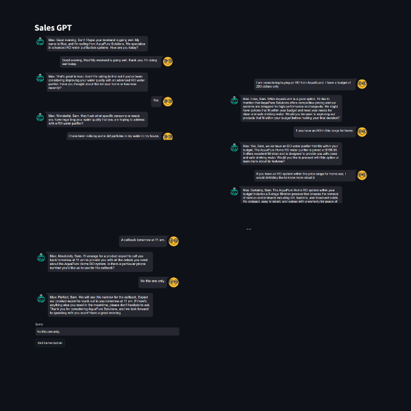
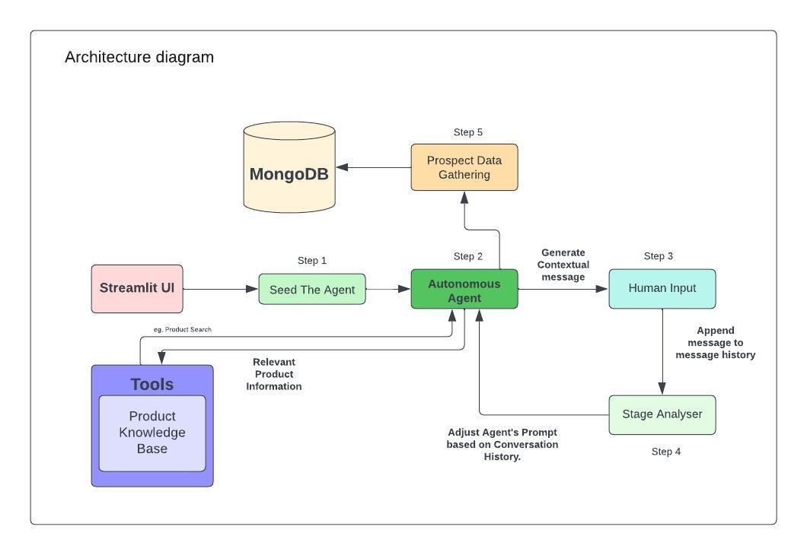
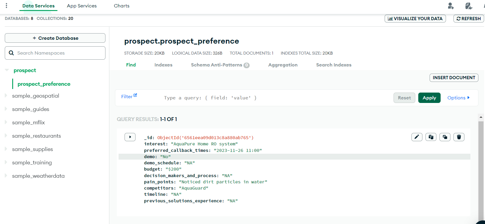

# SalesGPT: A GPT-based Sales Conversation Simulator 

# Architecture

## Old-Features
- **GPT-based Sales Conversations**: The application uses a GPT-4 model to simulate sales conversations. The model can generate responses to user queries in a conversational manner.

- **Sales Conversation Chain**: The application uses a `SalesConversationChain` to manage the flow of the conversation. This chain generates appropriate responses using current stage of the conversation..

- **Stage Analyzer Chain**: The application uses a `StageAnalyzerChain` to generate the current stage of the conversation. This chain uses the conversation history to determine the stage of the conversation.

## New-Features

- **Date, Time and Day Awareness**: The application is now aware of the current date, time, and day. This allows it to provide more context-aware responses and perform actions based on the current time.

- **Prospect Data Extraction**: The application can extract essential prospect data from the conversation history. This includes information such as the prospect's interest, preferred callback times, budget, decision-making process, pain points, competitors, timeline, and previous solutions experience.

- **JSON Response Format**: The extracted prospect data is returned in a structured JSON format. This makes it easy to use the data in other parts of the application or store it in a database.

- **MongoDB Integration for Data Storage**: The application stores the extracted prospect data in a MongoDB database. This allows for persistent storage and easy retrieval of prospect data.

## Installation
1. Install the required dependencies: `pip install -r requirements.txt`

## Configuration

1. Open the `mykey.py` file.
2. Replace the placeholder values with your actual open ai key and MongoDB Cluster URL.

## Usage

1. Run the main script: `streamlit run model.py`
2. Open a web browser and navigate to `http://localhost:8501` to view the Streamlit app.

## Logging

The application logs messages to a file named `app.log`. You can view the log messages by opening this file.

